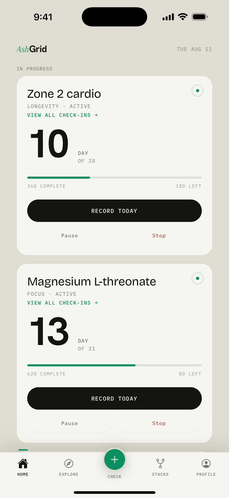
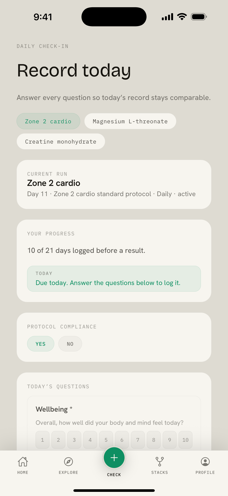
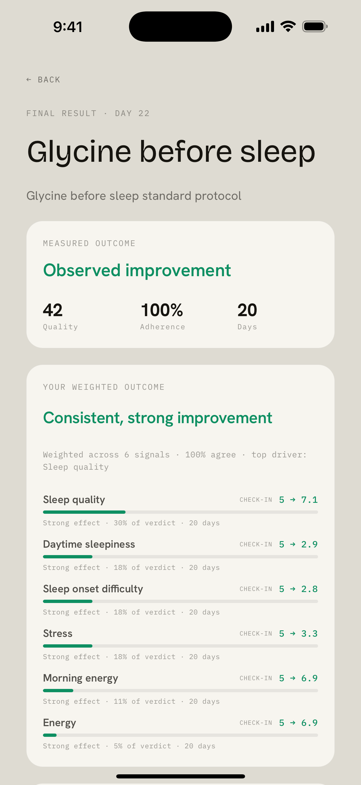
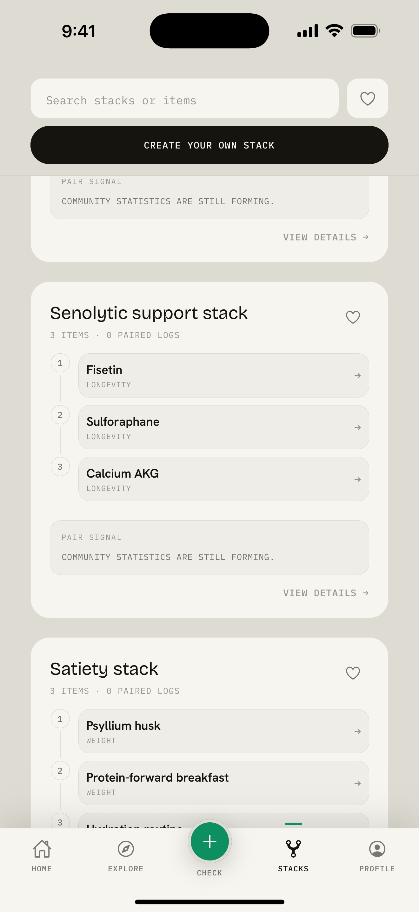

# AshGrid

Track what you're trying and find out whether it actually did anything.

[**Try it at ashgrid.co**](https://ashgrid.co) · Web app live · iOS build in progress · US, adults 18+

Most people already run experiments on themselves. A new supplement, cutting caffeine off
earlier, ten minutes of light in the morning. What usually goes missing is a fixed starting
point and consistent measurement, so you end up guessing whether anything really changed.

AshGrid keeps that part straight for you.

  
  
  
  

## How it works

Pick something to track, either from the built-in library or something you define yourself.
Answer one set of questions up front to record your starting snapshot. That snapshot stays
fixed for the whole run.

Check in on whatever schedule you'll actually keep, whether that's daily, a few times a week,
or every couple of weeks. The questions stay the same the entire time, so day 30 is
comparable to day 1.

Once you've logged enough days you get a result showing how things moved against your starting
snapshot, with the sample size and the uncertainty shown rather than folded into a single
score. If you want more signal you can keep going. Finishing is your call.

## Features

**Stacks.** Run two or three protocols at once under one shared starting snapshot, with the
overlap recorded so what you did together stays part of the record.

**Apple Health and Health Connect.** Sleep, HRV, resting heart rate and more feed into your
check-ins automatically, each value tagged with where it came from. Read-only, and nothing
about it is required since every metric can be entered by hand.

**Works offline.** Check-ins recorded without a connection are queued on the device and sync
once you're back, without duplicating anything.

**Community results.** Optional and pseudonymous. Aggregate results only appear once enough
people have tracked the same thing, so a handful of runs never gets presented as a pattern.

**Nothing gets overwritten.** A correction is a new entry pointing at the old one, and your
starting snapshot is fixed the moment it's taken.

## Built with

React Native and Expo on the client, TypeScript throughout. FastAPI and Python on the backend,
with PostgreSQL for storage. Statistics are computed with NumPy and SciPy.

## Notes

AshGrid is a personal observation tool for adults in the United States. It is not a medical
device and does not provide medical advice, diagnosis, or treatment.

The source is private since the app handles personal health data. Happy to walk through the
architecture or the code in an interview.

Built by [Ashley Pandey](https://github.com/ashleypandeyxx)
